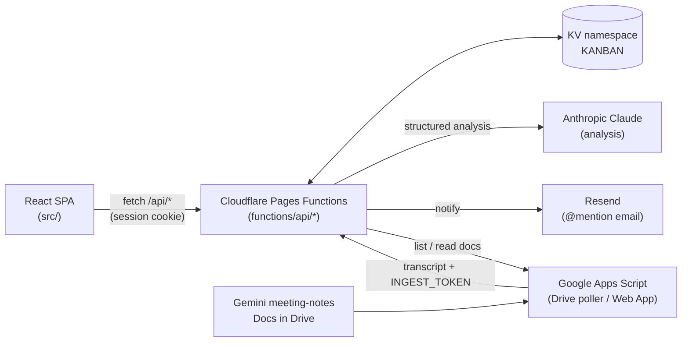

# Tektone Hub

Everything Tektone runs on the web, in one repo: the marketing site, staff ops
(kanban + meeting intelligence + commercial admin), a customer-only portal, and a
lead-pipeline CRM with an AI copilot — all unified under `tektone.com.br` with no
subdomains.

| Path | What | Live |
|---|---|---|
| `tektone.com.br` | Marketing site + shared login | ✅ |
| `tektone.com.br/hub`, `/task` | Staff ops — this README's original app | ✅ |
| `tektone.com.br/portal` | Customer-only panel | ✅ |
| `tektone.com.br/crm` | Lead pipeline, sales, AI copilot | ✅ |

**→ Read [`docs/ARCHITECTURE.md`](docs/ARCHITECTURE.md) first** — how the four surfaces share
one Cloudflare zone and one database without subdomains, the shared-backend trick that keeps
`/hub` and `/portal` running the same code, deploy commands for all four, and the secrets
checklist. This README covers the original staff-ops app (`/hub`) specifically; the
marketing site lives in [`marketing/`](marketing/) with its own README.

- **Access (hub/portal/crm):** closed — accounts are created via signup/invite, gated by
  `access_role` (ADMIN/STAFF/CUSTOMER) and `crm_role` (partner/closer/admin, nullable).
- **Stack (this app):** React 19 + Vite + Tailwind v4 + Framer Motion · Cloudflare Workers
  (see `docs/ARCHITECTURE.md` for why Workers, not Pages).

---

## Features

### Board & cards
- **5 columns** (Backlog · A Fazer · Em Andamento · Em Revisão · Concluído) with
  drag-and-drop, collapsible columns (desktop), and a search + priority filter.
- **Projects** (clients) in the sidebar; scope the board to one project or see all.
- **Cards** carry: title, description, **multiple assignees** (avatars), priority,
  due date (custom calendar), status, highlight color, **checklist** (with progress),
  **links & references**, and a **comment thread**.
- **Card badges** show checklist progress, link/comment counts, open-request count,
  and a ✨ *reunião* tag for AI-generated cards.

### Comments & material requests
- Threaded **comments** per card; any comment can be flagged a **solicitação** (material
  request) and later **marcada como atendida**.
- **@mentions** with autocomplete; mentioned teammates get notified.
- A **filter / bottom-nav tab** surfaces every card with an open request.

### Notifications
- **In-app bell** with per-user unread counts (polls every 60s); deep-links open the card.
- **Email** on @mention via Resend — branded HTML (Mineral palette), embedded author
  photo, reply-to the commenter, and a deep link back to the exact card.

### Meeting Intelligence (Claude)
- **Automatic:** a Google Apps Script polls Drive for new Gemini meeting-notes Docs and
  posts the transcript to the app, which runs Claude to extract a **summary + decisions
  + risks + action items**, saves them to the right project (auto-created if missing),
  and records a **validation popup** shown on next login.
- **Interactive:** the **reuniões** button opens *Inteligência de Reuniões* — paste a
  transcript (or, admin-only, pick one from Drive), review, pick the project, save.
- **Admin "buscar":** list and on-demand import meetings from Drive.
- Full setup is documented in **[`automation/README.md`](automation/README.md)**.

### Profiles & admin
- Per-user **profile** (photo upload, role, phone, location, bio); photos appear on
  card avatars across the team.
- **Admin** (Hudson) can reset accounts and run the meeting fetch.

### Mobile
- **Bottom nav:** Quadro · Solicitações · Reuniões · Perfil (full-screen destinations;
  Perfil is a bottom sheet).
- **One column at a time**, swipe to switch; cards scroll within the column (no page
  scroll). Solicitações shows a flat list of all open requests.
- **Card editor** is a draggable bottom sheet; keyboard opens only when a field is tapped.

---

## Architecture



- **Frontend:** `src/` — `App.jsx` orchestrates; components in `src/components/`,
  API client in `src/lib/api.js`, board config/palette in `src/lib/constants.js`.
- **Backend:** Cloudflare Pages Functions under `functions/api/` (file-based routing,
  catch-all `[[path]].js`). All state lives in one KV namespace, **`KANBAN`**.
- **Auth:** email allowlist + signed-cookie sessions (`functions/_lib/`). The
  `_middleware.js` guards every `/api/kanban/*` request.

---

## API / Functions reference

All under `/api`. `kanban/*` requires a valid session cookie (enforced by middleware).

### `functions/api/auth/[[path]].js` — accounts & identity
| Route | Method | Purpose |
|---|---|---|
| `/auth/check` | POST | Is this email allowed / does an account exist (email-first login) |
| `/auth/signup` | POST | First-access account creation (PBKDF2 password) |
| `/auth/login` | POST | Sign in → sets `tk_session` cookie |
| `/auth/logout` | POST | Clear session |
| `/auth/me` | GET | Current session: `{ authed, email, admin, name, avatar }` |
| `/auth/profile` | GET/PUT | Current user's profile (name, role, phone, location, bio, avatar) |
| `/auth/directory` | GET | Teammates' `{ email, name, avatar }` (for card avatars) |
| `/auth/admin/users` · `/auth/admin/reset` | GET · POST | Admin-only: list / reset accounts |

### `functions/api/kanban/[[path]].js` — board data (session-guarded)
| Resource | Routes | Purpose |
|---|---|---|
| `clients` | GET/POST `/clients`, PUT/DELETE `/clients/:id` | Projects |
| `cards` | GET/POST `/cards`, PUT/DELETE `/cards/:id` | Cards |
| `cards/:id/comments` | POST, POST `/:cid/resolve`, DELETE `/:cid` | Comments / material requests (+@mention email) |
| `cards/:id/seen` | POST | Mark a card's comments read (per user) |
| `members` | GET/POST `/members`, PUT/DELETE `/members/:id` | Team members |
| `notifications` | GET | Per-user unread comment notifications |
| `reviews` | GET, POST `/reviews/ack` | Meeting-import validation popup batches |

### `functions/api/analyze/[[path]].js` — meeting intelligence (Claude)
| Route | Auth | Purpose |
|---|---|---|
| `/analyze/meeting` | session | Run Claude → structured analysis (no save) |
| `/analyze/commit` | session | Save reviewed action items + 📝 Resumo card |
| `/analyze/auto` | bearer `INGEST_TOKEN` | Headless analyze + save + review batch (called by Apps Script) |

### `functions/api/ingest/[[path]].js` — simple importer
| Route | Auth | Purpose |
|---|---|---|
| `/ingest/meeting-notes` | bearer `INGEST_TOKEN` | Regex-only "Próximas etapas" → cards (no AI; legacy/alternative) |

### `functions/api/meetings/[[path]].js` — admin Drive fetch (proxy to Apps Script Web App)
| Route | Purpose |
|---|---|
| `/meetings/list` (GET) | List Drive meeting docs (id, title, date, processed) |
| `/meetings/text?id=` (GET) | Fetch one doc's transcript (for the interactive page) |
| `/meetings/process` (POST) | Import selected docs |

### `functions/api/avatar/[[path]].js` — public avatar image
- `GET /api/avatar?email=` → the user's profile photo as an image (so emails can embed it).

---

## Data model

Board data (`kanban:cards`, `kanban:clients`) originally lived in the `KANBAN` KV
namespace — it's now on D1 (`tasks`, `projects` tables) behind the `TASKS_BACKEND` flag in
`wrangler.worker.toml` (currently `"d1"`; the KV code path in `functions/_lib/tasksStore.js`
is kept as a documented one-line revert, not actively used). **The full current data model
— every D1 table across hub/portal/crm — is in
[`docs/ARCHITECTURE.md`](docs/ARCHITECTURE.md#data-model-d1-hub-tektone).**

---

## Environment / secrets

**See [`docs/ARCHITECTURE.md`](docs/ARCHITECTURE.md#secrets-checklist)** for the full
per-Worker checklist (this app is one of three Workers now — `tektone-hub`, and secrets
aren't shared automatically between Workers even though they share a D1). Quick reference:

```sh
npx wrangler secret put NAME --config wrangler.worker.toml
```

---

## Develop & deploy

```sh
npm install
npm run dev      # Vite dev server (UI only — API calls 404 until deployed or run under wrangler dev)
npm run build    # production build → dist/
```

Deploying this app specifically (see `docs/ARCHITECTURE.md` for portal/crm/marketing):
```sh
npm run build
npx wrangler pages functions build --outdir=./dist/_worker.js/
npx wrangler deploy --config wrangler.worker.toml
```

`npm run deploy` (the old `wrangler pages deploy dist --project-name=tektone-app` script)
still exists and still works — it's the original standalone Pages deployment
(`tasks.tektone.com.br`), kept alive until that subdomain has a redirect to `/hub` (see
`docs/ARCHITECTURE.md`'s outstanding items). **Don't run it after building for `/hub`** —
the `dist/` it deploys would be built with `base: "/hub/"`, which breaks at domain root.

---

## Repo layout

This repo now holds all of Tektone's web properties — see
[`docs/ARCHITECTURE.md`](docs/ARCHITECTURE.md) for the full picture. This app (`/hub`)
specifically:

```
src/
  App.jsx                  orchestrator (state, layout, mobile nav)
  components/              Board, CardModal, Sidebar, TopBar, NotificationsBell,
                           MeetingIntelligence, MeetingFetch, ReviewPopup, ProfilePage,
                           AdminPanel, CustomerShell, Login, ui (Avatar, Spinner, useIsMobile…)
  crm/                     CRM frontend (CrmApp, CrmDashboard, CrmLeads, CrmLeadDetail, CrmSales)
  lib/                     api.js (REST client), constants.js (columns, palette, helpers)
functions/
  _middleware.js           session guard for /api/kanban/*
  _lib/                    session.js (auth crypto), db.js, rbac.js, allowlist.js
  api/{auth,kanban,analyze,ingest,meetings,avatar,projects,finances,addons,workflow-templates}/[[path]].js
worker/
  hub-entry.js              tektone-hub's entry — strips /hub or /task, delegates to functions/
  portal-entry.js            tektone-portal's entry — strips /portal, delegates to functions/
  crm-entry.js                tektone-crm's entry — new Hono routes + delegates auth/assets to functions/
  lib/                        crmDb.js, crmRbac.js, crmKbService.js, wonAutomation.js,
                               businessSpecialistService.js, retry.js
migrations/                   D1 schema, numbered — see docs/ARCHITECTURE.md
marketing/                    the Next.js marketing site + shared /login (own README)
docs/ARCHITECTURE.md          full system writeup — read this first
wrangler.toml                 legacy standalone Pages deploy (tasks.tektone.com.br)
wrangler.worker.toml          tektone-hub
wrangler.portal.toml          tektone-portal
wrangler.crm.toml             tektone-crm
automation/
  meeting-notes-sync.gs    Google Apps Script (Drive → app)
  appsscript.json          pinned timezone (America/Sao_Paulo)
  README.md                full automation setup
```

---

## Notes

- **Timezone** for all scheduling is **America/Sao_Paulo**.
- Meeting analysis runs on **Anthropic Claude** (forced tool use → guaranteed structured
  JSON). The legacy regex importer (`/ingest/meeting-notes`) still exists as a no-AI option.
- See **[`automation/README.md`](automation/README.md)** for the end-to-end Google Apps
  Script + secrets setup.
